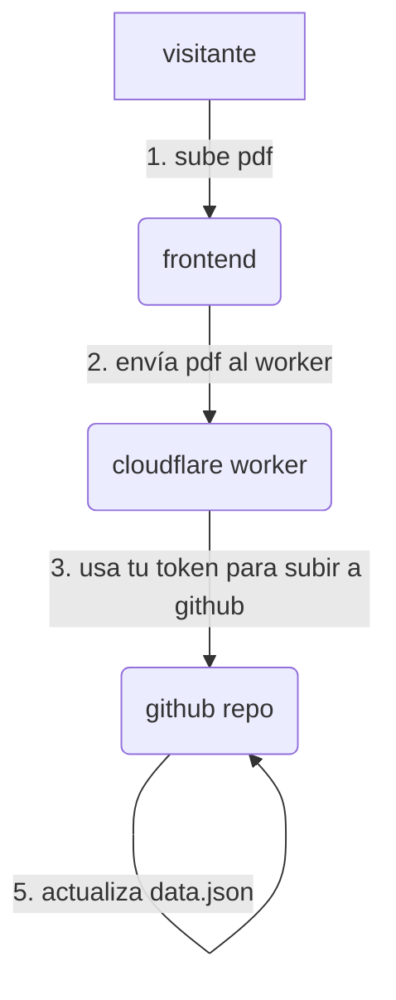

# arxiu

un sistema de archivo de PDFs minimalista, anónimo y auto-alojado. la interfaz es una simple página web que imita un explorador de archivos retro. cualquiera puede subir un PDF sin necesidad de tener cuenta de github.


---

## cómo funciona

el sistema se divide en tres partes que se comunican entre sí:

1.  **frontend (github pages)**: la página web estática (html/css/js) que ve el visitante. desde aquí se pueden ver los archivos y subir nuevos.
2.  **backend (cloudflare worker)**: un pequeño script que actúa como intermediario seguro. recibe los archivos del visitante y los sube a github usando tu token personal.
3.  **base de datos (github repo)**: el propio repositorio de github actúa como base de datos. los PDFs se guardan en la carpeta `/data` y el índice de archivos en `data.json`.



este método permite que cualquiera suba archivos sin que tú tengas que exponer tu token de github en el código del frontend.

---

## stack tecnológico

-   **frontend**: html, css y javascript vainilla (sin frameworks).
-   **backend**: cloudflare workers (javascript).
-   **automatización**: github actions (para re-indexar hashtags y filtrar contenido).
-   **hosting**: github pages (frontend) y cloudflare (backend), ambos gratuitos.

---

## setup y mantenimiento (guía para el dueño del repo)

para que todo funcione, necesitas configurar tres cosas: el **frontend**, el **backend (worker)** y los **workflows**.

### paso 1: desplegar el frontend en github pages

1.  ve a la pestaña `settings` de tu repositorio en github.
2.  en el menú de la izquierda, ve a `pages`.
3.  en `source`, selecciona la rama `main` y la carpeta `/ (root)`.
4.  haz clic en `save`.

en unos minutos, tu página estará disponible en `https://TUNOMBRE.github.io/arxiu`.

### paso 2: desplegar el backend en cloudflare workers

1.  **instala wrangler**, la herramienta de línea de comandos de cloudflare:
    ```bash
    npm install -g wrangler
    ```
2.  **inicia sesión** en tu cuenta de cloudflare:
    ```bash
    wrangler login
    ```
3.  **navega a la carpeta `worker`** del proyecto:
    ```bash
    cd worker
    ```
4.  **publica el worker** por primera vez:
    ```bash
    wrangler deploy
    ```
    la primera vez te hará algunas preguntas. puedes aceptar los valores por defecto. al final te dará una url tipo `https://arxiu-worker.TUNOMBRE.workers.dev`.

5.  **configura las variables secretas**:
    -   **`GITHUB_TOKEN`**: necesitas un [personal access token](https://github.com/settings/tokens/new) con permisos de `repo` (control total de repositorios privados y públicos).
        ```bash
        wrangler secret put GITHUB_TOKEN
        ```
        pega tu token (empieza por `ghp_...`) y pulsa enter.

    -   **`ALLOWED_ORIGIN`**: la url de tu github pages para evitar que otras webs usen tu worker.
        ```bash
        wrangler secret put ALLOWED_ORIGIN
        ```
        pega la url de tu github pages (ej: `https://meowrhino.github.io`).

6.  **actualiza la url del worker en `app.js`**:
    -   abre el archivo `app.js`.
    -   en la línea 5, cambia la `WORKER_URL` por la url que te dio wrangler en el paso 4.
    -   guarda, haz commit y push de este cambio.

### paso 3: subir los workflows de github actions

el token de integración de manus no tiene permisos para crear workflows (es una restricción de seguridad de github). tienes que subirlos tú manualmente:

1.  en la web de github, ve a tu repositorio.
2.  haz clic en `add file > create new file`.
3.  en el nombre del archivo, escribe `.github/workflows/update-hashtags.yml`.
4.  copia y pega el contenido del archivo `update-hashtags.yml` que está en la carpeta `worker` de este proyecto.
5.  haz clic en `commit new file`.
6.  repite los pasos 2-5 para el archivo `content-filter.yml`.

---

## estructura del proyecto

```
/arxiu
├── .github/workflows/   # automatizaciones
│   ├── content-filter.yml # revisa pdfs en busca de palabrotas
│   └── update-hashtags.yml# actualiza la lista de hashtags
├── data/                # aquí se guardan los pdfs subidos
│   └── .gitkeep         # placeholder para que la carpeta exista
├── manus/               # notas del proceso de creación
│   └── ...
├── worker/              # código del backend (cloudflare worker)
│   ├── worker.js        # la lógica del proxy seguro
│   └── wrangler.toml    # configuración del worker
├── app.js               # toda la lógica del frontend
├── data.json            # el índice de todos los archivos
├── index.html           # la estructura de la página
├── README.md            # esta guía
└── style.css            # todos los estilos visuales
```

---

creado por [meowrhino.studio](https://meowrhino.studio)
