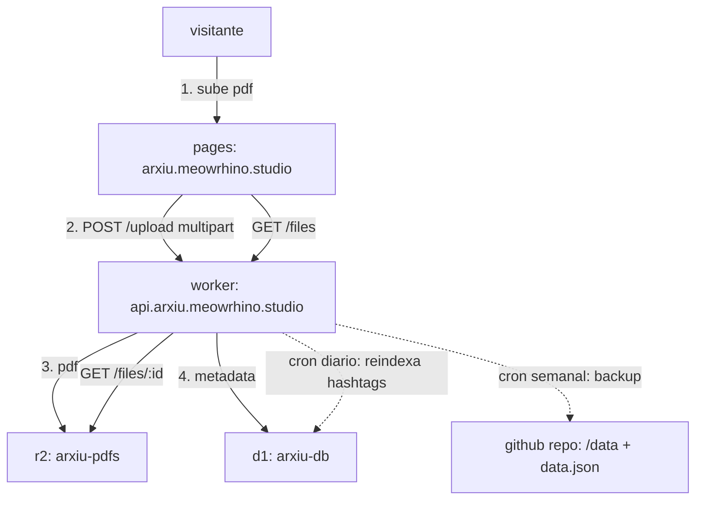

# arxiu

archivo de pdfs minimalista, anónimo y auto-alojado sobre cloudflare.

interfaz web estilo explorador de archivos retro. cualquiera puede subir un pdf sin cuenta.


---

## arquitectura

100% cloudflare:

- **frontend**: cloudflare pages (html/css/js vainilla).
- **api**: cloudflare worker (`worker/worker.js`).
- **almacén de pdfs**: r2 bucket `arxiu-pdfs` (privado, servido a través del worker).
- **índice**: d1 database `arxiu-db` (tablas `files` y `hashtags`).
- **rate-limit**: kv namespace `RATE_LIMIT`.
- **backup**: cron semanal sincroniza d1→`data.json` y r2→`/data/` en este mismo repo github.


```mermaid
graph TD
  U[visitante] -->|1. sube pdf| F[pages: arxiu.meowrhino.studio]
  F -->|2. POST /upload multipart| W[worker: api.arxiu.meowrhino.studio]
  W -->|3. pdf| R[r2: arxiu-pdfs]
  W -->|4. metadata| D[d1: arxiu-db]
  F -->|GET /files| W
  W -->|GET /files/:id| R
  W -.->|cron diario: reindexa hashtags| D
  W -.->|cron semanal: backup| G[github repo: /data + data.json]
```

---

## endpoints del worker

- `GET  /files`        → lista pdfs publicados + hashtags
- `POST /upload`       → multipart: `file`, `author`, `hashtags`, `is_18_plus`
- `GET  /files/:id`    → sirve el pdf (content-type application/pdf)
- `POST /moderate`     → flag/unflag/delete (requiere header `x-moderation-token`)
- `GET  /health`       → ping

---

## deploy desde cero

requisitos: cuenta cloudflare, `npx wrangler` (no hace falta instalar global), dominio `meowrhino.studio` gestionado en cloudflare, pat github con scope `repo` para el backup.

### 1. crear recursos cloudflare

```bash
cd worker

# d1
npx wrangler d1 create arxiu-db
# → copia el database_id a wrangler.toml

# r2
npx wrangler r2 bucket create arxiu-pdfs

# kv
npx wrangler kv namespace create RATE_LIMIT
# → copia el id a wrangler.toml
```

### 2. cargar schema y migrar datos

```bash
# desde worker/
./migrate.sh
```

esto:
1. aplica `schema.sql` en d1 remoto.
2. inserta los 13 registros actuales desde `migrate-data.sql`.
3. sube los pdfs de `/data/` a r2 con key `<id>.pdf`.

idempotente: se puede re-ejecutar sin romper nada (los inserts son `OR IGNORE`).

### 3. configurar secrets

```bash
npx wrangler secret put ALLOWED_ORIGIN
# pega: https://arxiu.meowrhino.studio  (o la url de tu pages)

npx wrangler secret put MODERATION_TOKEN
# pega: token arbitrario largo, lo necesitas para POST /moderate

npx wrangler secret put GITHUB_TOKEN
# pega: pat con scope 'repo' (solo para el cron de backup semanal)
```

### 4. desplegar el worker

```bash
npx wrangler deploy
```

primera vez: funcionará en `arxiu-worker.<tu-subdominio>.workers.dev`.

### 5. conectar al dominio (opcional pero recomendado)

en el dashboard de cloudflare → dns:
- crea un record `a` o `aaaa` proxied para `api.arxiu.meowrhino.studio`.

luego descomenta el bloque `[[routes]]` en `wrangler.toml` y redeploy:

```toml
[[routes]]
pattern = "api.arxiu.meowrhino.studio/*"
zone_name = "meowrhino.studio"
```

```bash
npx wrangler deploy
```

### 6. frontend en cloudflare pages

en el dashboard → pages → conectar con este repo:
- build command: (vacío)
- output dir: `/`
- custom domain: `arxiu.meowrhino.studio`

actualiza `app.js` línea 2 con la url final de la api (`https://api.arxiu.meowrhino.studio`).

### 7. verificar

- abre `https://arxiu.meowrhino.studio` y debes ver los 13 archivos.
- sube un pdf nuevo desde la interfaz.
- clica un archivo → debe abrirse el pdf.
- `curl https://api.arxiu.meowrhino.studio/health` → `{"ok":true}`.

---

## moderación

```bash
# marcar como flagged (deja de aparecer en listados)
curl -X POST https://api.arxiu.meowrhino.studio/moderate \
  -H "x-moderation-token: TU_TOKEN" \
  -H "content-type: application/json" \
  -d '{"id":"<id>","action":"flag"}'

# borrar del todo (borra de r2 y marca como deleted en d1)
curl ... -d '{"id":"<id>","action":"delete"}'
```

---

## estructura del proyecto

```
/arxiu
├── index.html          # frontend
├── style.css
├── app.js
├── favicon.svg
├── data/               # backup automático de pdfs (cron semanal)
├── data.json           # backup automático del índice (cron semanal)
└── worker/
    ├── worker.js       # api rest + crons
    ├── wrangler.toml
    ├── schema.sql
    ├── migrate-data.sql
    └── migrate.sh
```

---

creado por [meowrhino.studio](https://meowrhino.studio)
